<p align="center">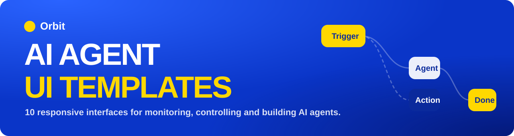</p>

<p align="center">
  
  
  
  
  
  
</p>

# Orbit: AI Agent UI Templates

> A collection of 10 modern, responsive web interfaces for **monitoring, controlling and building AI agents**, built by a team of three with a real GitHub workflow (Fork, Branch, Commit, Pull Request, Review, Merge).

---

## Team

| | |
|---|---|
| **Team name** | `[TEAM NAME]` |
| **Selected UI topic** | **AI Agents** (category 4 of the project brief) |
| **Repository** | [manoj-kumar2277/ai-agent-ui-templates](https://github.com/manoj-kumar2277/ai-agent-ui-templates) |

| Member | GitHub | Role | UIs built |
|---|---|---|---|
| `[Member 1 name]` | [@manoj-kumar2277](https://github.com/manoj-kumar2277) | Repository owner, coordinator, UI developer | Dashboard, Agent List, Agent Profile, Status Monitoring |
| `[Member 2 name]` | [@username](https://github.com/username) | Reviewer, UI developer | Task Queue, Activity Log, Approval Interface |
| `[Member 3 name]` | [@username](https://github.com/username) | Tester, UI developer | Workflow Builder, Execution Timeline, Permissions |

---

## Preview

<table>
<tr>
<td width="50%"><a href="agent-dashboard/">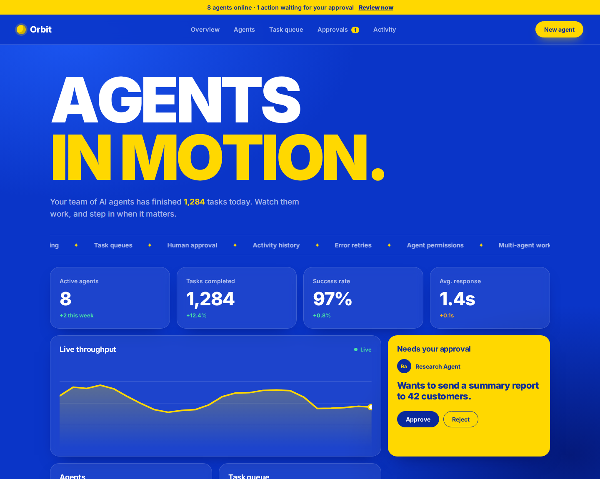</a><br><b>1. Agent Dashboard</b></td>
<td width="50%"><a href="agent-list/">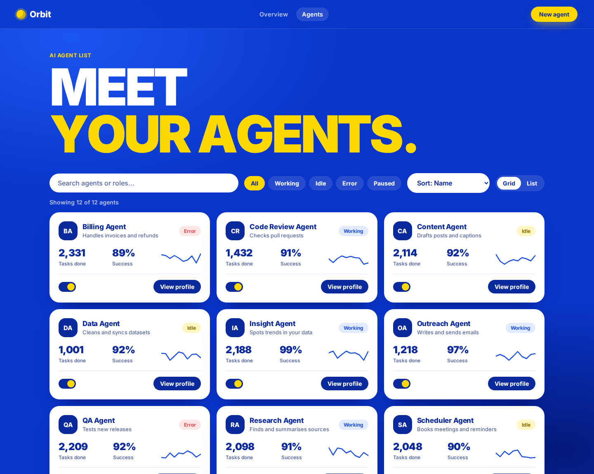</a><br><b>2. Agent List</b></td>
</tr>
<tr>
<td><a href="agent-profile/">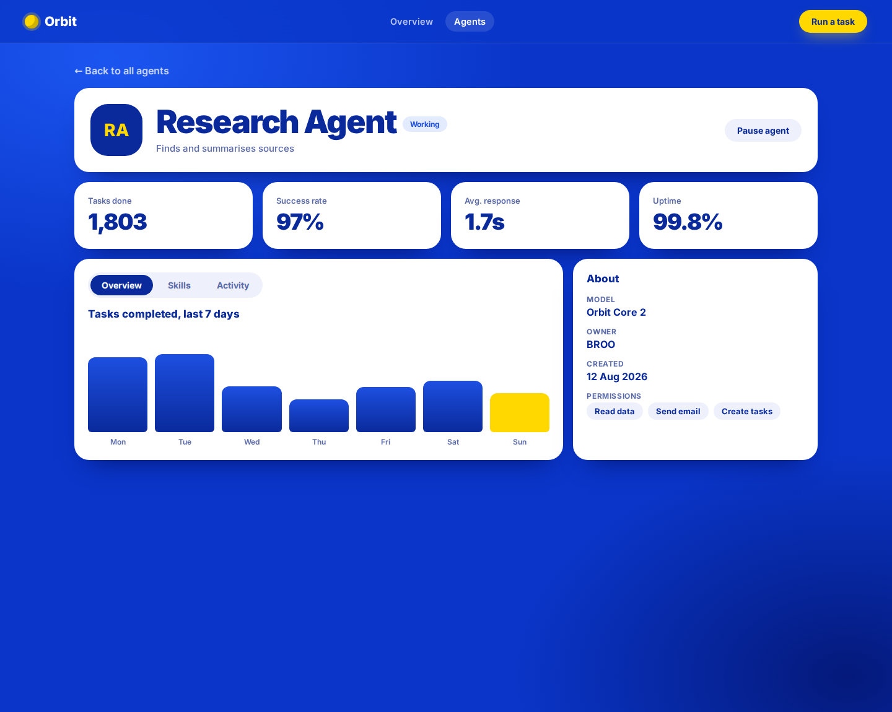</a><br><b>3. Agent Profile</b></td>
<td><a href="agent-status/">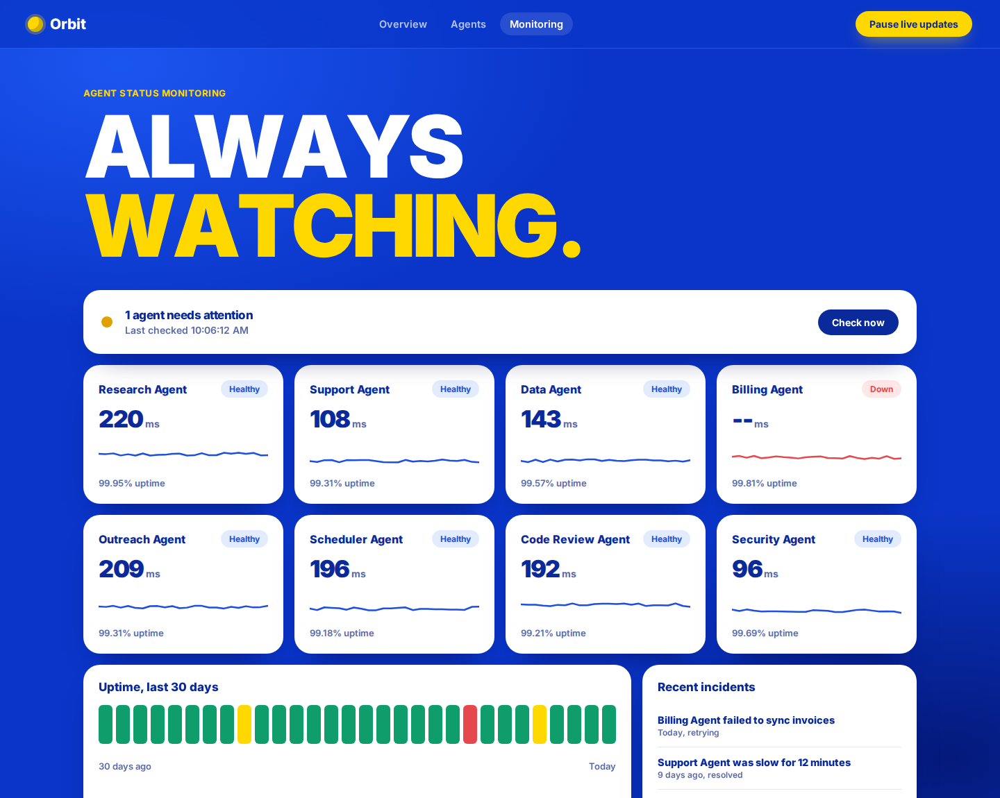</a><br><b>4. Status Monitoring</b></td>
</tr>
<tr>
<td><a href="agent-queue/">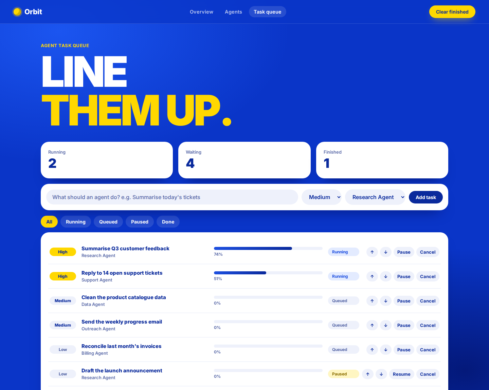</a><br><b>5. Task Queue</b></td>
<td><a href="agent-log/">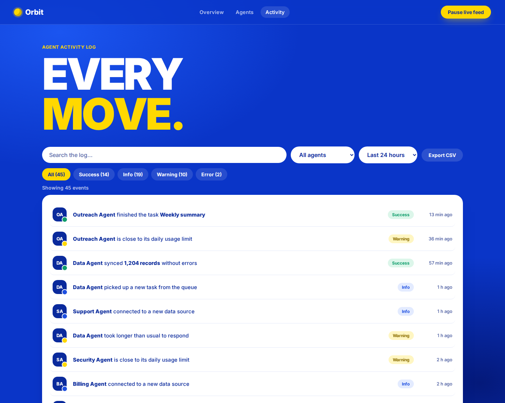</a><br><b>6. Activity Log</b></td>
</tr>
<tr>
<td><a href="agent-approval/">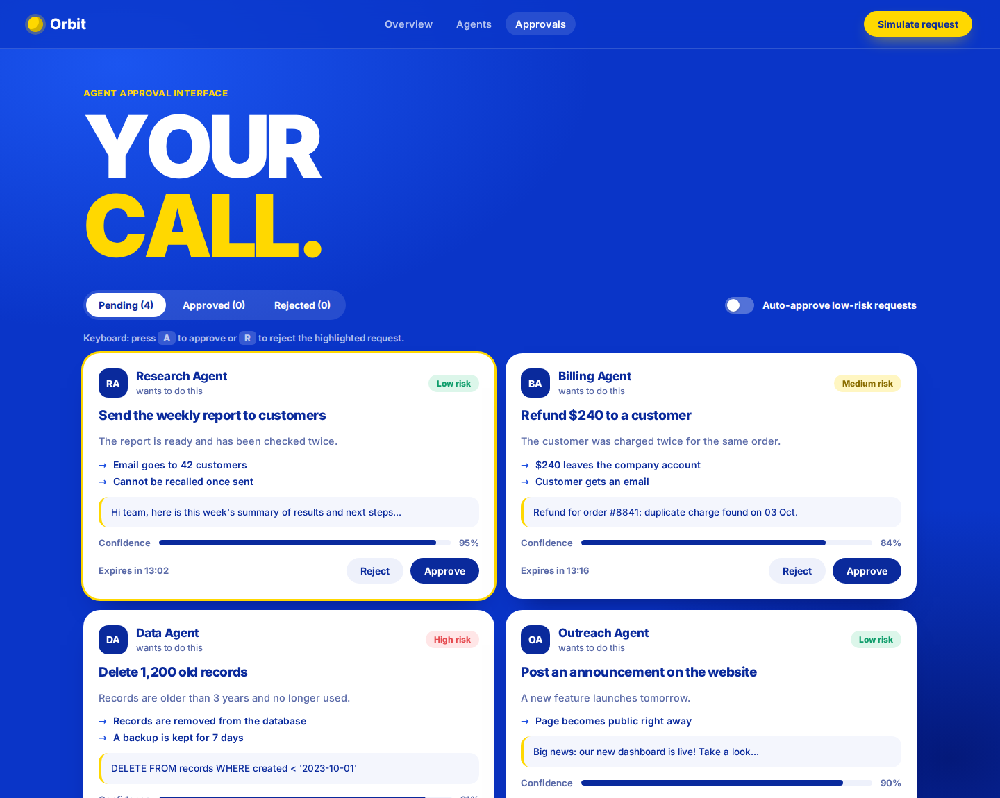</a><br><b>7. Approval Interface (human in the loop)</b></td>
<td><a href="agent-workflow/">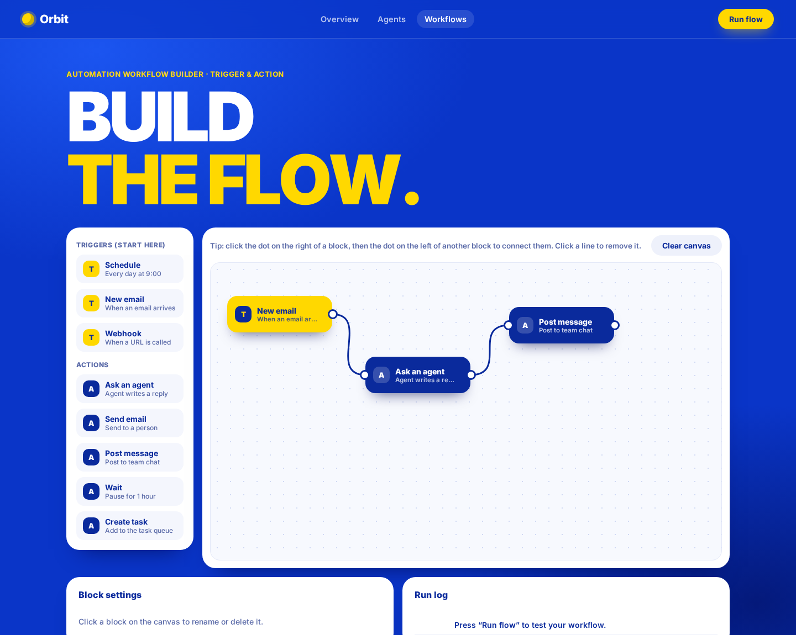</a><br><b>8. Automation Workflow Builder</b></td>
</tr>
<tr>
<td><a href="agent-timeline/">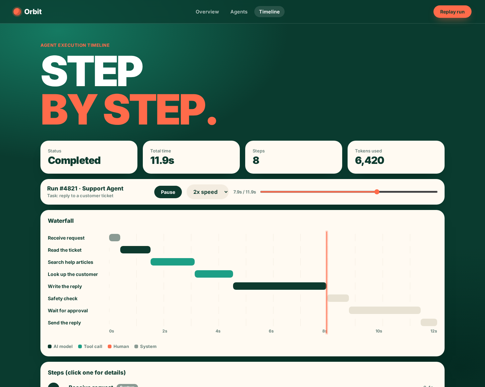</a><br><b>9. Execution Timeline</b></td>
<td><a href="agent-permissions/">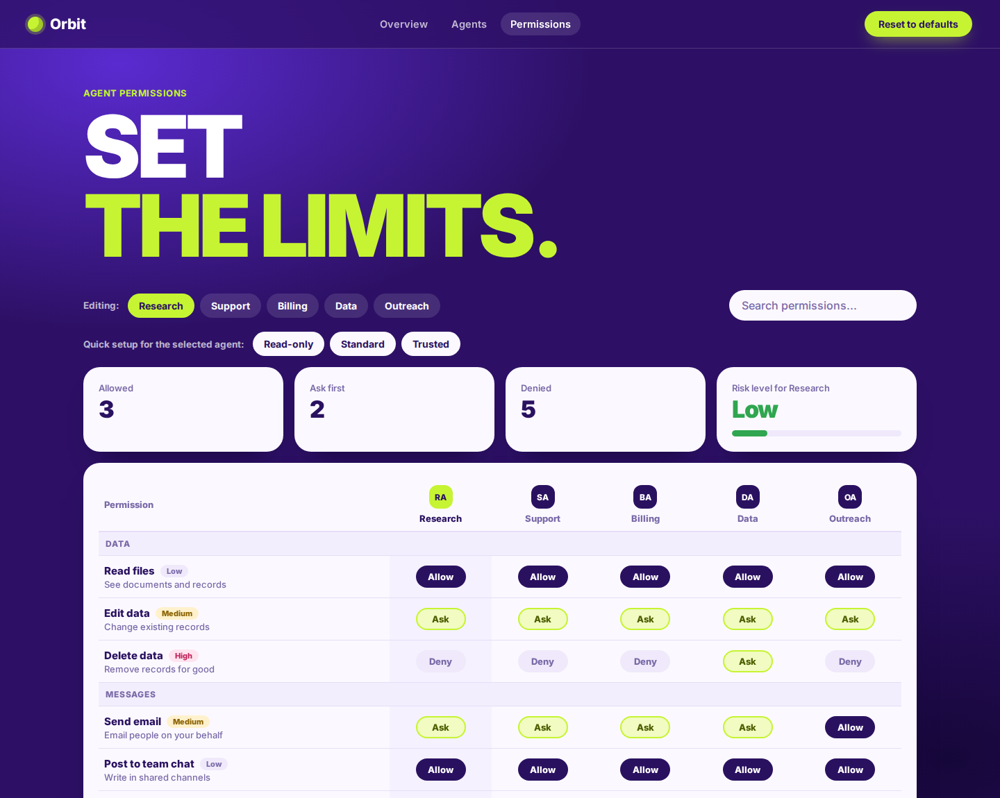</a><br><b>10. Agent Permissions</b></td>
</tr>
</table>

---

## Implemented UIs

| # | UI | What it does | Highlights | Live demo | Code |
|---|---|---|---|---|---|
| 1 | **Agent Dashboard** | Control room with KPIs, live chart, agents, task queue, activity log and an approval card | Count-up numbers, live chart, working approve and reject | [Open](https://manoj-kumar2277.github.io/ai-agent-ui-templates/agent-dashboard/) | [`agent-dashboard`](agent-dashboard/) |
| 2 | **Agent List** | Browse all agents as cards | Search, status filters, sort, grid and list view | [Open](https://manoj-kumar2277.github.io/ai-agent-ui-templates/agent-list/) | [`agent-list`](agent-list/) |
| 3 | **Agent Profile** | Detail page for one agent | Tabs, animated bars and skill meters, pause and resume | [Open](https://manoj-kumar2277.github.io/ai-agent-ui-templates/agent-profile/) | [`agent-profile`](agent-profile/) |
| 4 | **Status Monitoring** | Live health of every agent | Auto-changing banner, live latency lines, 30-day uptime | [Open](https://manoj-kumar2277.github.io/ai-agent-ui-templates/agent-status/) | [`agent-status`](agent-status/) |
| 5 | **Task Queue** | Work waiting for agents | 2 tasks run at once, reorder, pause, cancel, add tasks | [Open](https://manoj-kumar2277.github.io/ai-agent-ui-templates/agent-queue/) | [`agent-queue`](agent-queue/) |
| 6 | **Activity Log** | Feed of everything agents did | Live events, filters, click to expand, CSV export | [Open](https://manoj-kumar2277.github.io/ai-agent-ui-templates/agent-log/) | [`agent-log`](agent-log/) |
| 7 | **Approval Interface** | A person approves risky agent actions | Risk labels, expiry timers, A and R keyboard shortcuts, auto-approve | [Open](https://manoj-kumar2277.github.io/ai-agent-ui-templates/agent-approval/) | [`agent-approval`](agent-approval/) |
| 8 | **Workflow Builder** | Visual trigger and action canvas | Drag and drop, connect blocks, test run with live log | [Open](https://manoj-kumar2277.github.io/ai-agent-ui-templates/agent-workflow/) | [`agent-workflow`](agent-workflow/) |
| 9 | **Execution Timeline** | Step by step view of one agent run | Waterfall chart, replay, speed control, scrubber | [Open](https://manoj-kumar2277.github.io/ai-agent-ui-templates/agent-timeline/) | [`agent-timeline`](agent-timeline/) |
| 10 | **Permissions** | What each agent is allowed to do | Deny, Ask, Allow matrix, risk meter, presets, save bar | [Open](https://manoj-kumar2277.github.io/ai-agent-ui-templates/agent-permissions/) | [`agent-permissions`](agent-permissions/) |

Every UI folder has its own `README.md` with research notes.

### How the UIs fit together

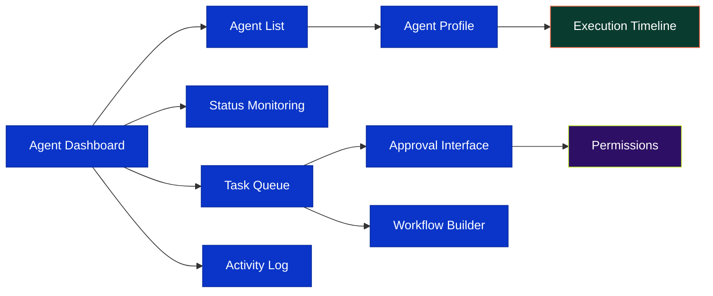

---

## Topic research: AI Agents

1. **What the UI pattern is.** An AI agent is software that does tasks on its own: reading, writing, searching and calling tools. Agent interfaces are the screens people use to watch agents, give them work, set limits, and step in when needed.
2. **Where it is commonly used.** AI automation platforms, customer-support tools, workflow builders (like Zapier or n8n), developer tools and AI observability products.
3. **Why it is relevant to modern web interfaces.** Agents act without a person watching every step. People need clear status, history, control and trust, so these screens are a fast-growing part of modern products.
4. **Design and interaction patterns we observed.** Live status chips and health banners, progress bars, streaming activity feeds, approval cards with risk labels, node-and-line workflow canvases, trace and waterfall views, and permission matrices.
5. **What our implementation does differently.** Every page is *alive*: data updates in real time and the controls work. We added a three-level permission model (**Deny, Ask, Allow**) that links permissions to the human approval screen, a replayable execution timeline, and keyboard shortcuts for approvals. All 10 share one design language, with colour variations on the last two.

---

## Design

All pages use **Inter** (heavy weights for headlines), a large animated headline, pill buttons, a custom cursor, and smooth motion that respects `prefers-reduced-motion`. The visual style is inspired by the bold, motion-design look of [indianschoolofmotion.com](https://indianschoolofmotion.com/), implemented as an original design.

| Palette | Colours | Used in |
|---|---|---|
| **Blue, yellow, white** |  `#0A35C8`  `#FFD800`  `#FFFFFF` | UIs 1 to 8 |
| **Green, coral, cream** |  `#0A3B2F`  `#FF6B4A`  `#FFFAF2` | Execution Timeline |
| **Violet, lime, lavender** |  `#2D1065`  `#C6F432`  `#FBF9FF` | Permissions |

---

## Technologies used

| | |
|---|---|
| **Structure** | HTML5 |
| **Style** | CSS3 (Grid, Flexbox, custom properties, animations, `color-mix`) |
| **Behaviour** | Vanilla JavaScript (ES6+), SVG, Pointer Events |
| **Font** | Inter (Google Fonts) |
| **Tools** | Git, GitHub (branches, Pull Requests, code review) |
| **Not used** | No frameworks, no libraries, no build step |

---

## Run the project

**Option 1: open a file.** Clone the repo and open any `index.html` in a modern browser.

```bash
git clone https://github.com/manoj-kumar2277/ai-agent-ui-templates.git
cd ai-agent-ui-templates
```

Then open, for example, `agent-dashboard/index.html`.

**Option 2: local server (VS Code).** Right-click `index.html` and choose **Open with Live Server**.

> Keep the folder names as they are. The pages link to each other with relative paths.

### Project structure

```text
ai-agent-ui-templates/
├── README.md
├── assets/banner.svg
├── docs/screenshots/        (preview images)
├── agent-dashboard/         index.html, style.css, script.js, README.md
├── agent-list/
├── agent-profile/
├── agent-status/
├── agent-queue/
├── agent-log/
├── agent-approval/
├── agent-workflow/
├── agent-timeline/
└── agent-permissions/
```

---

## GitHub workflow

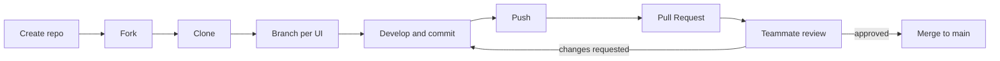

- One **branch per UI**, named `feature/<ui-name>`. Nobody worked directly on `main`.
- Each UI went in through its own **Pull Request**, using clear commit messages.
- Every Pull Request was **reviewed by a different teammate** before merging.
- Review rotation: Member 2 reviews Member 1, Member 3 reviews Member 2, Member 1 reviews Member 3.

See the [Pull Requests](https://github.com/manoj-kumar2277/ai-agent-ui-templates/pulls?q=is%3Apr) and the [commit history](https://github.com/manoj-kumar2277/ai-agent-ui-templates/commits/main) for the full record.

---

## Quality checklist

- [x] HTML, CSS and JavaScript only
- [x] Responsive layouts (desktop, tablet, phone)
- [x] Works in modern browsers
- [x] Clean, readable code with meaningful names
- [x] A README with research in every UI folder
- [x] Original implementations, not copies of existing websites
- [x] Keyboard-friendly controls and reduced-motion support

---

<p align="center"><b>Learn GitHub. Build UI. Collaborate. Contribute.</b></p>
